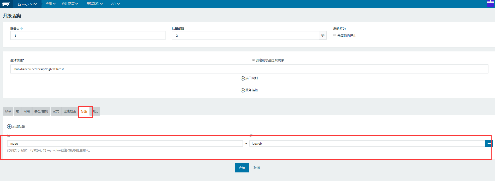

# 持续集成（CI）与测试

文档维护 | 辰枫
---|---
更新日期 | 2017-11-27
文档版本 | v1.0


GitLab提供可持续集成服务。只要在你的仓库**根目录** [创建一个.gitlab-ci.yml 文件][yaml语法]，

并为该项目指派一个Runner，当有合并请求或者 push的时候就会触发CI pipeline

## 构建配置文件

目前常用的流程是:
测试（运行测试用例） -  构建（打包上传Docker镜像）
如果需要的话还可以加上：发布（自动更新Rancher上的容器）

### 关键字

stages : 定义 Stages，默认有三个 Stages，分别是 build, test, deploy。

types : stages 的别名。

before_script : 定义任何 Jobs 运行前都会执行的命令。

tags : 指定Runner

### 参考文件
```
image: hub.dianchu.cc/library/gotool:latest

#设置变量/如果有私密变量，可以在gitlab 项目流水线设置中配置
variables:
  DOCKER_DRIVER: overlay
  DC_REGISTRY: hub.dianchu.cc
  DC_REGISTRY_USER: gitlab_ci
  DC_REGISTRY_PASS: Gitlab_c1

before_script:   # 任何 Jobs 运行前都会执行before_script中的命令
  - echo $GOPATH
  - ln -s "$PWD" $GOPATH/src/$CI_PROJECT_NAME
  - cd $GOPATH/src/$CI_PROJECT_NAME

stages:
  - test  # 测试
  - build_image # 构建
  - deploy # 发布

test:
  stage: test
  script:
    - go test -v ./...
  tags:
    - rancher_docker  # 指定Runner

build_image:
  stage: build_image
  script:
    - export BUILD_TAG=$(cat version)
    #编译
    - govendor build -tags=jsoniter -v
    #打包
    - docker login -u $DC_REGISTRY_USER -p $DC_REGISTRY_PASS $DC_REGISTRY
    - echo $DC_REGISTRY/library/$CI_PROJECT_NAME:$BUILD_TAG
    - docker build -t $DC_REGISTRY/library/$CI_PROJECT_NAME:$BUILD_TAG .
    #测试运行
    - docker run --rm $DC_REGISTRY/library/$CI_PROJECT_NAME:$BUILD_TAG -test
    #推送镜像
    - docker push $DC_REGISTRY/library/$CI_PROJECT_NAME:$BUILD_TAG
    - docker tag $DC_REGISTRY/library/$CI_PROJECT_NAME:$BUILD_TAG $DC_REGISTRY/library/$CI_PROJECT_NAME:latest
    - docker push $DC_REGISTRY/library/$CI_PROJECT_NAME:latest
  tags:
    - rancher_docker

deploy:
  stage: deploy
  script:
    - export DEPLOY_URL="#Webhooks URL"
    - export IMAGE=$DC_REGISTRY/library/$CI_PROJECT_NAME
    - curl -X POST $DEPLOY_URL -H 'content-type:application/json' -d '{"push_data":{"tag":"latest"},"repository":{"repo_name":"'"$IMAGE"'"}}'
  tags:
    - rancher_docker
  only:
    - master # 只有在master才允许

```

获取Webhooks URL：





### 设置变量

项目设置-流水线


### 关于Runner

国内镜像：https://mirrors.tuna.tsinghua.edu.cn/help/gitlab-ci-multi-runner/

官方文档：https://docs.gitlab.com.cn/ce/ci/quick_start/README.html#configuring-a-runner