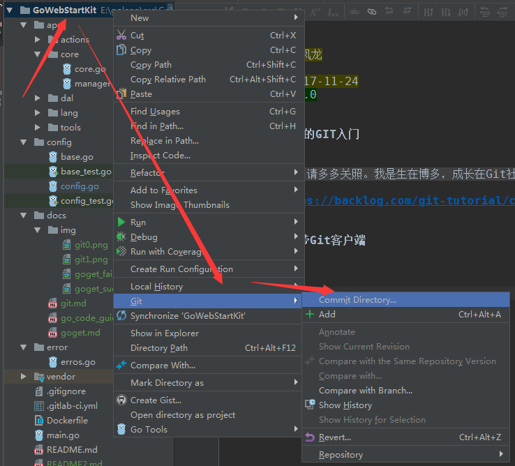
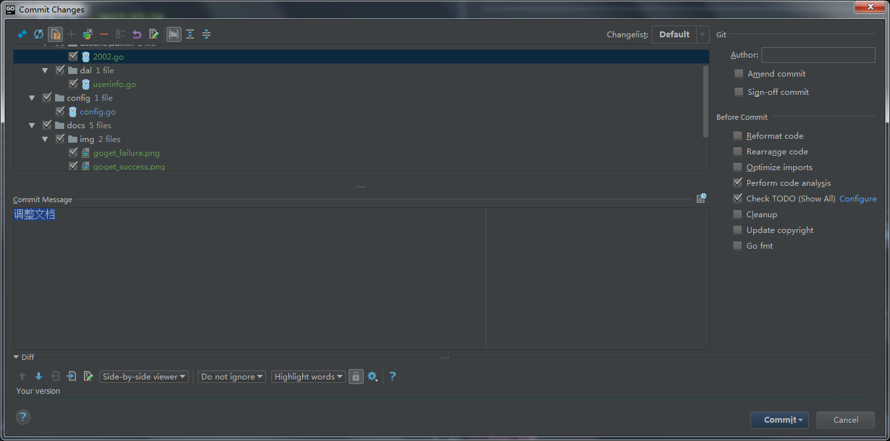
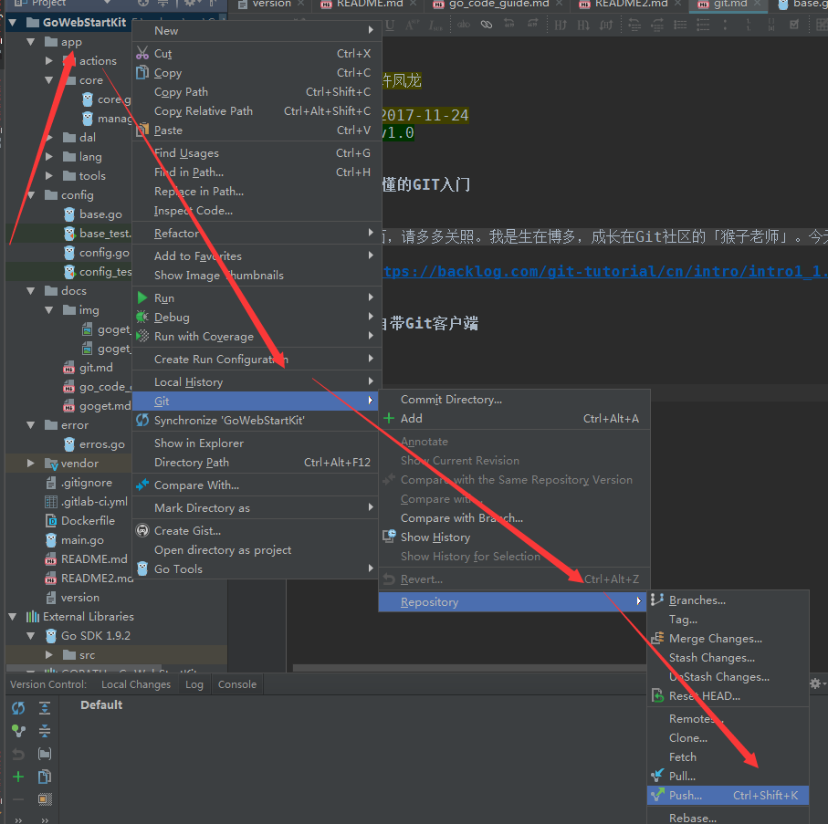
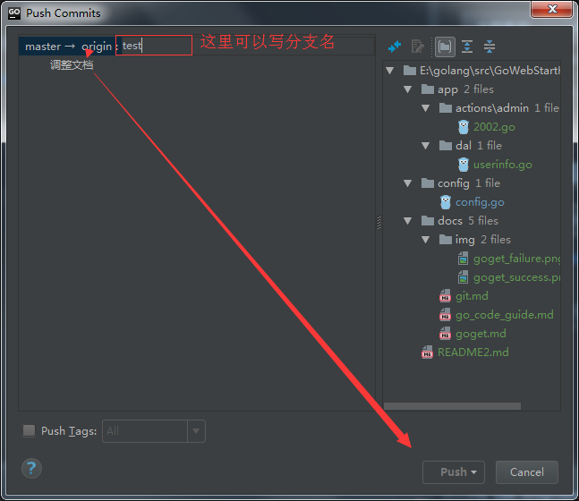
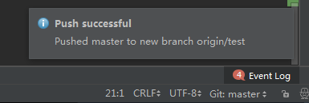
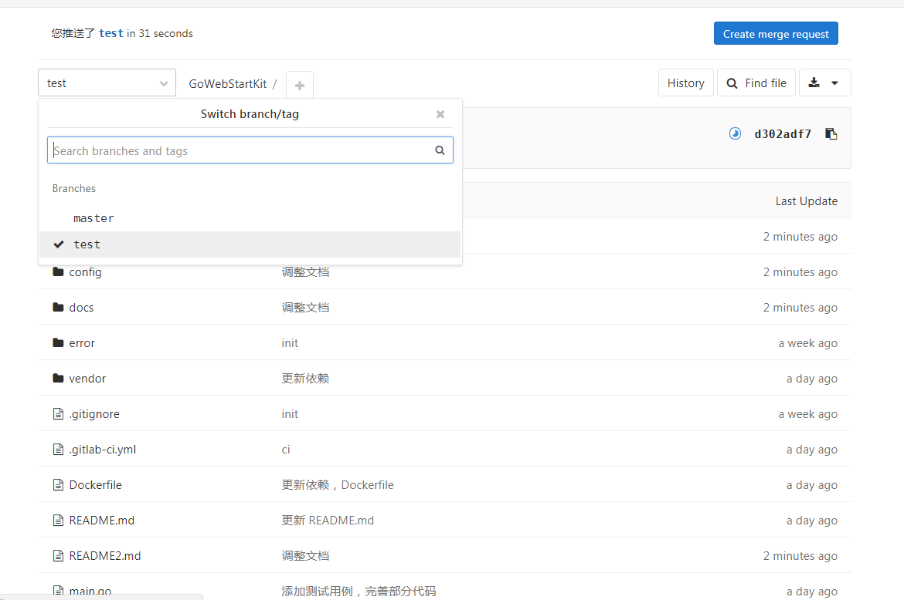
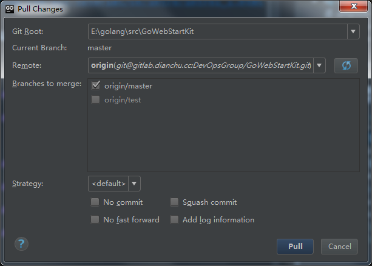

# Git相关

文档维护 | 辰枫
---|---
更新日期 | 2017-11-24
文档版本 | v1.0

## 猴子都能懂的GIT入门

TortoiseGit下载：https://tortoisegit.org/

教程地址：https://backlog.com/git-tutorial/cn/intro/intro1_1.html

## GoLand自带Git客户端

### commit

### push

### pull

与push相似

