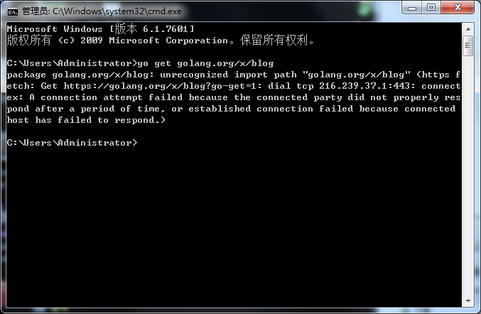
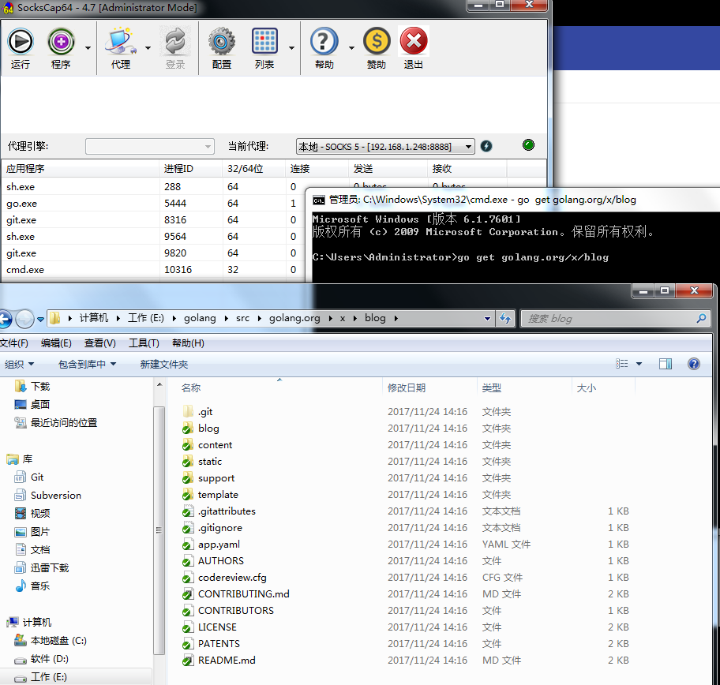

# Go Get 代理配置

文档维护 | 辰枫
---|---
更新日期 | 2017-11-24
文档版本 | v1.0


由于某些 go 资源被墙，导致go get命令无法正常使用。

因此内网代理扩展了一个HTTP代理

代理地址为：http://192.168.1.248:7777
```
shell
@SET http_proxy=http://192.168.1.248:7777
@SET https_proxy=http://192.168.1.248:7777
@%comspec% /k
```
或者使用SocksCap连接内网的SOCKS5代理（192.168.1.248:8888）进行下载

无代理状态下：




使用SocksCap：

设置好代理地址后(192.168.1.248:8888).

设置CMD.exe到SocksCap中,通过SocksCap运行CMD.exe再执行go get



（下载完成后命令窗口可能会没有反应）