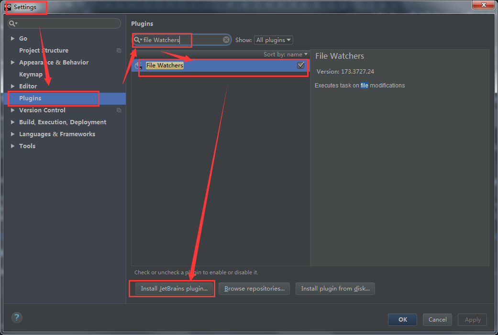
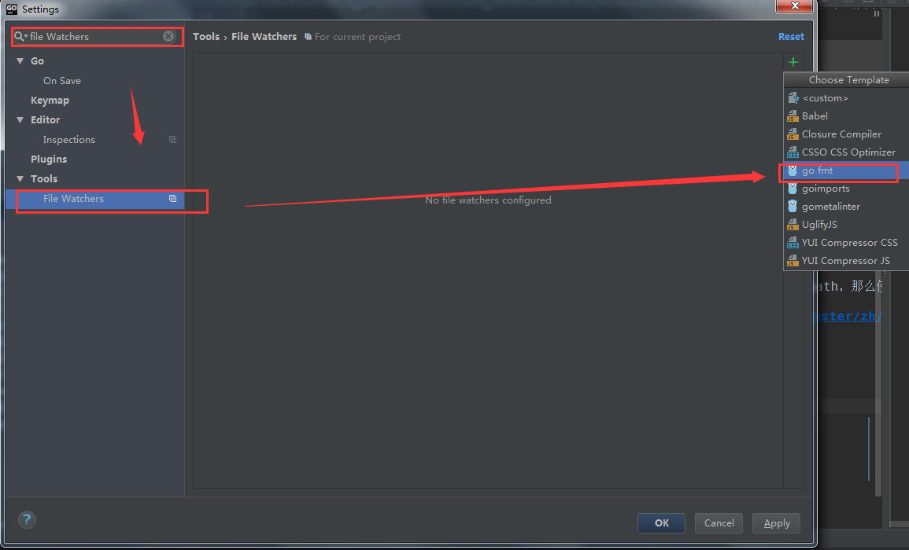
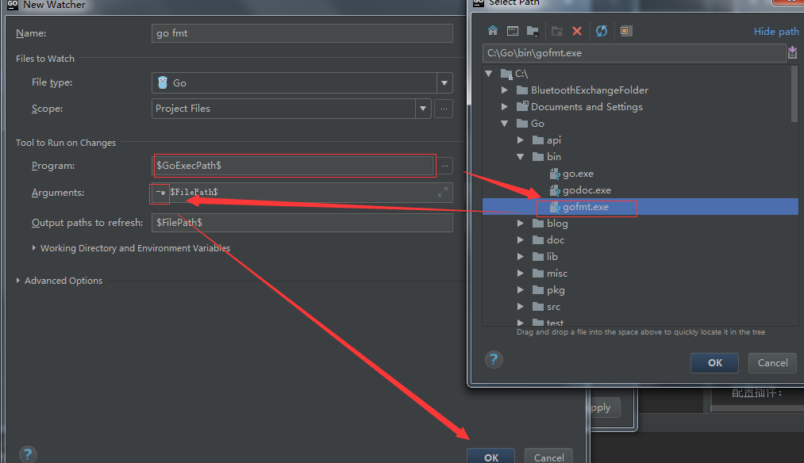
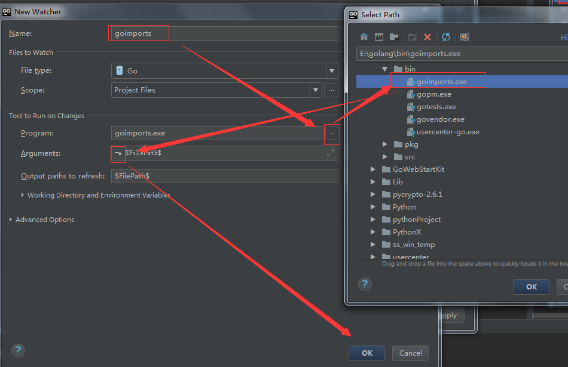

# Go环境与IDE推荐配置

文档维护 | 辰枫
---|---
更新日期 | 2017-11-24
文档版本 | v1.0


## Go与IDE下载

Go: https://golang.org/dl/

IDE: https://www.jetbrains.com/go/


## GOPATH与工作空间

我们在安装Go的时候看到需要设置GOPATH变量，Go从1.1版本到1.7必须设置这个变量，而且不能和Go的安装目录一样，这个目录用来存放Go源码，Go的可运行文件，以及相应的编译之后的包文件。所以这个目录下面有三个子目录：src、bin、pkg

从go 1.8开始，GOPATH环境变量现在有一个默认值，如果它没有被设置。 它在Unix上默认为$HOME/go,在Windows上默认为%USERPROFILE%/go。
### GOPATH设置
  go 命令依赖一个重要的环境变量：$GOPATH

  Windows系统中环境变量的形式为`%GOPATH%`，本书主要使用Unix形式，Windows用户请自行替换。

  *（注：这个不是Go安装目录。下面以笔者的工作目录为示例，如果你想不一样请把GOPATH替换成你的工作目录。）*

  在类 Unix 环境下大概这样设置：
```
export GOPATH=/home/apple/mygo
```
  为了方便，应该新建以上文件夹，并且上一行加入到 `.bashrc` 或者 `.zshrc` 或者自己的 `sh` 的配置文件中。

  Windows 设置如下，新建一个环境变量名称叫做GOPATH：
```
GOPATH=c:\mygo
```
GOPATH允许多个目录，当有多个目录时，请注意分隔符，多个目录的时候Windows是分号，Linux系统是冒号，当有多个GOPATH时，默认会将go get的内容放在第一个目录下。


以上 $GOPATH 目录约定有三个子目录：

- src 存放源代码（比如：.go .c .h .s等）
- pkg 编译后生成的文件（比如：.a）
- bin 编译后生成的可执行文件（为了方便，可以把此目录加入到 $PATH 变量中，如果有多个gopath，那么使用`${GOPATH//://bin:}/bin`添加所有的bin目录）

转自：https://github.com/astaxie/build-web-application-with-golang/edit/master/zh/01.2.md

## IDE推荐配置

### 自动格式化

下载插件：file Watchers：



配置插件：



EXE可能在工作目录也可能在Go安装目录




